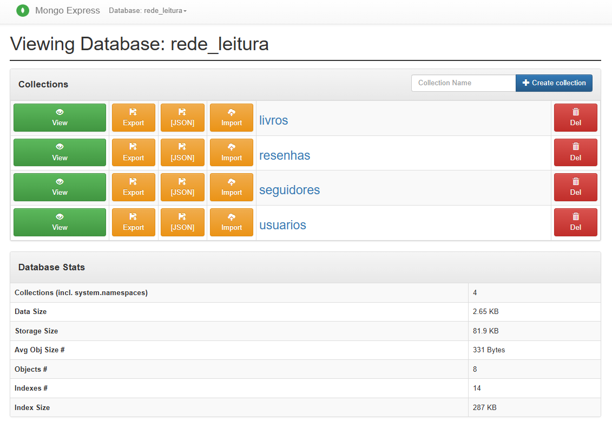
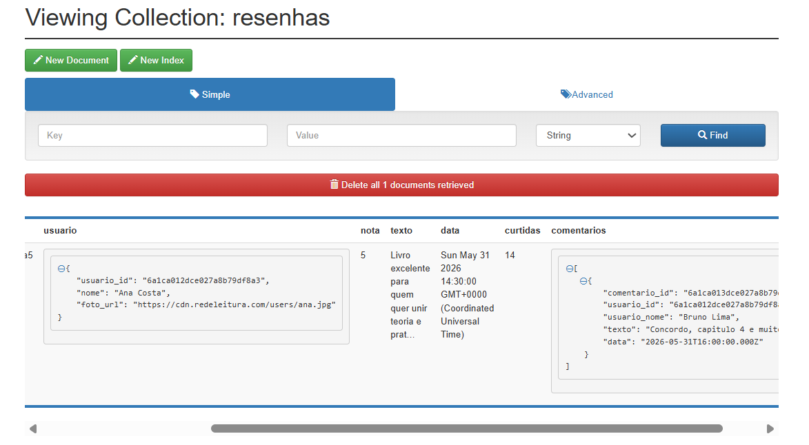

---

## Atividade MongoDB — Relacionamentos e Schema Design

Este arquivo traz as respostas da atividade sobre modelagem de dados no MongoDB,
usando o cenário de uma rede social de leitura.

### Parte 1.1 — Decisões embed x referência

#### Coleções propostas

- `usuarios`
- `livros`
- `resenhas`
- `seguidores` (coleção de ligação para follow)

Observação: os estados de estante (`lido`, `lendo`, `quero_ler`) ficam dentro de
`usuarios` como listas de IDs de livros, porque são dados usados com frequência no
perfil e na biblioteca da pessoa.

### Coleções no Mongo:


#### Documento de exemplo por coleção

`usuarios`:

```json
{
   "_id": { "$oid": "6845a4f11111111111111111" },
   "nome": "Ana Costa",
   "email": "ana@redeleitura.com",
   "perfil": {
      "bio": "Leio fantasia e ficcao cientifica.",
      "foto_url": "https://cdn.redeleitura.com/users/ana.jpg",
      "preferencias": {
         "privacidade": "publico",
         "idioma": "pt-BR"
      }
   },
   "cadastrado_em": { "$date": "2026-05-31T14:30:00Z" },
   "estantes": {
      "lido": [
         { "$oid": "6845a4f12222222222222221" },
         { "$oid": "6845a4f12222222222222222" }
      ],
      "lendo": [{ "$oid": "6845a4f12222222222222223" }],
      "quero_ler": [{ "$oid": "6845a4f12222222222222224" }]
   }
}
```

`livros`:

```json
{
   "_id": { "$oid": "6845a4f12222222222222221" },
   "titulo": "Arquitetura de Dados Moderna",
   "autores": [
      { "nome": "Diego Pereira", "autor_id": { "$oid": "6845a4f13333333333333331" } }
   ],
   "editora": "IFPB Press",
   "ano": 2024,
   "generos": ["Tecnologia", "Banco de Dados"],
   "isbn": "978-65-00000-01-2",
   "sinopse": "Guia pratico de modelagem relacional e NoSQL.",
   "resumo_resenhas": {
      "media_nota": 4.6,
      "total_resenhas": 128,
      "ultima_atualizacao": { "$date": "2026-05-31T14:30:00Z" }
   }
}
```

`resenhas`:

```json
{
   "_id": { "$oid": "6845a4f14444444444444441" },
   "livro_id": { "$oid": "6845a4f12222222222222221" },
   "usuario": {
      "usuario_id": { "$oid": "6845a4f11111111111111111" },
      "nome": "Ana Costa",
      "foto_url": "https://cdn.redeleitura.com/users/ana.jpg"
   },
   "nota": 5,
   "texto": "Livro excelente para quem quer unir teoria e pratica.",
   "data": { "$date": "2026-05-31T14:30:00Z" },
   "curtidas": 14,
   "comentarios": [
      {
         "comentario_id": { "$oid": "6845a4f15555555555555551" },
         "usuario_id": { "$oid": "6845a4f11111111111111112" },
         "usuario_nome": "Bruno Lima",
         "texto": "Concordo, capitulo 4 e muito bom.",
         "data": { "$date": "2026-05-31T16:00:00Z" }
      }
   ]
}
```

### Exemplo no Mongo:


`seguidores`:

```json
{
   "_id": { "$oid": "6845a4f16666666666666661" },
   "seguidor_id": { "$oid": "6845a4f11111111111111111" },
   "seguido_id": { "$oid": "6845a4f11111111111111112" },
   "desde": { "$date": "2026-05-31T14:30:00Z" }
}
```

#### Justificativas por relacionamento

**(a) Usuário ↔ foto/perfil/configurações: embedding**

Perfil e configurações são dados 1:1 e quase sempre aparecem juntos.
Por isso, faz sentido guardar tudo no mesmo documento do usuário.
Também é um conjunto pequeno, então não há risco de crescer demais.

**(b) Resenha ↔ comentários: embedding com controle de outlier**

Comentários normalmente são lidos junto com a resenha.
Por isso, deixar os comentários dentro da resenha facilita a leitura da tela.
Se uma resenha receber comentários demais, o excedente pode ir para uma coleção separada.

**(c) Livro ↔ resenhas: referência**

Resenhas podem crescer muito, principalmente em livros famosos.
Se tudo ficasse dentro de `livros`, o documento poderia ficar grande demais.
Separar em `resenhas` facilita paginação, filtro e ordenação.

**(d) Usuário ↔ livros nas estantes (N:N): referência em arrays no usuário**

Cada pessoa costuma consultar mais a própria estante.
Por isso, guardar listas de `livro_id` no documento de `usuarios` deixa essa leitura rápida.
No lado de `livros`, não guardamos lista de usuários para evitar crescimento excessivo.

**(e) Usuário ↔ usuários (seguir, N:N): coleção de ligação (`seguidores`)**

Relação de seguir pode crescer muito em alguns perfis.
Se isso ficasse em listas dentro de `usuarios`, o documento poderia ficar pesado.
Com `seguidores`, fica fácil consultar "quem eu sigo" e "quem me segue" sem duplicar dados.

### Parte 1.2 — Cardinalidade que muda a decisão (Livro ↔ resenhas)

Para um livro comum (com poucas resenhas), dá para guardar um pequeno resumo,
como as últimas 3 resenhas, para mostrar rápido na tela.

Para best-seller (com muitas resenhas), é melhor manter tudo em `resenhas`
e buscar por páginas.

Nesse caso, a ideia é usar um resumo no documento do livro (média, total e últimas)
e deixar o restante na coleção de resenhas.
Assim, a leitura principal fica leve e o documento não cresce sem controle.

### Parte 1.3 — N:N (seguir): de que lado guardar?

A escolha é usar a coleção `seguidores`, com um documento para cada relação.
Isso facilita as duas consultas: "quem eu sigo" e "quem me segue".

Em contas muito grandes, listas dentro de `usuarios` podem crescer demais.
Também fica mais difícil manter os dois lados sincronizados sem erro.

Se necessário, dá para guardar contadores (`seguindo_count`, `seguidores_count`)
no próprio documento do usuário.

### Script executável da atividade

Arquivo: `scripts/08-atividade-schema-social-leitura.js`

Executar no **PowerShell**:

```powershell
Get-Content -Raw .\scripts\08-atividade-schema-social-leitura.js | docker exec -i aula08-mongo mongosh
```

### Parte 2 — `$lookup` e agregação

Base usada: `livraria` (carregada por `scripts/01-seed-livraria.js`).

#### 2.1 — Enriquecer o dataset

Script: `scripts/09-atividade-parte2-21-enriquecer.js`

Executar:

```powershell
Get-Content -Raw .\scripts\09-atividade-parte2-21-enriquecer.js | docker exec -i aula08-mongo mongosh
```

Foram inseridos 4 livros novos, usando IDs de `editora` e `autor`:

- `MongoDB Performance Tuning` (Manning, 2 autores)
- `Guia Prático de Agregações` (Manning, 1 autor)
- `Modelagem NoSQL no Brasil` (Magica, 1 autor)
- `Data Pipelines com MongoDB` (O'Reilly, 2 autores)

Resultado obtido na execução:

```javascript
Inseridos: 4 livros

Livros inseridos (title, editora, qtd_autores):
[
   { title: 'Data Pipelines com MongoDB', editora: "O'Reilly", qtd_autores: 2 },
   { title: 'Guia Prático de Agregações', editora: 'Manning', qtd_autores: 1 },
   { title: 'Modelagem NoSQL no Brasil', editora: 'Magica', qtd_autores: 1 },
   { title: 'MongoDB Performance Tuning', editora: 'Manning', qtd_autores: 2 }
]

Check dos critérios:
- Livro com 2+ autores: 2
- Livros da editora Manning entre os novos: 2
```

#### 2.2 — `$lookup` básico

Script: `scripts/10-atividade-parte2-22-lookup.js`

Executar:

```powershell
Get-Content -Raw .\scripts\10-atividade-parte2-22-lookup.js | docker exec -i aula08-mongo mongosh
```

##### 2.2(a) Livros com nome e cidade da editora

Pipeline completo:

```javascript
[
   {
      $lookup: {
         from: "editora",
         localField: "editora",
         foreignField: "_id",
         as: "ed"
      }
   },
   { $unwind: "$ed" },
   {
      $project: {
         _id: 0,
         title: 1,
         editora: "$ed.nome",
         cidade: "$ed.cidade"
      }
   },
   { $sort: { title: 1 } }
]
```

Resultado obtido:

```javascript
[
   { title: 'Contos da Paraiba', editora: 'Magica', cidade: 'Joao Pessoa' },
   { title: 'Data Pipelines com MongoDB', editora: "O'Reilly", cidade: 'Sebastopol' },
   { title: 'Guia Prático de Agregações', editora: 'Manning', cidade: 'Shelter Island' },
   { title: 'Modelagem NoSQL no Brasil', editora: 'Magica', cidade: 'Joao Pessoa' },
   { title: 'MongoDB Performance Tuning', editora: 'Manning', cidade: 'Shelter Island' },
   { title: 'MongoDB in Action', editora: 'Manning', cidade: 'Shelter Island' },
   { title: 'MongoDB: The Definitive Guide', editora: "O'Reilly", cidade: 'Sebastopol' }
]
```

##### 2.2(b) Livros com nomes dos autores (N:N)

Pipeline completo:

```javascript
[
   {
      $lookup: {
         from: "autor",
         localField: "autores",
         foreignField: "_id",
         as: "autores_doc"
      }
   },
   {
      $project: {
         _id: 0,
         title: 1,
         autores: "$autores_doc.nome"
      }
   },
   { $sort: { title: 1 } }
]
```

Resultado obtido:

```javascript
[
   { title: 'Contos da Paraiba', autores: [] },
   { title: 'Data Pipelines com MongoDB', autores: ['Shannon Bradshaw', 'Kristina Chodorow'] },
   { title: 'Guia Prático de Agregações', autores: ['Kristina Chodorow'] },
   { title: 'Modelagem NoSQL no Brasil', autores: ['Kyle Banker'] },
   { title: 'MongoDB Performance Tuning', autores: ['Kyle Banker', 'Shannon Bradshaw'] },
   { title: 'MongoDB in Action', autores: ['Kyle Banker'] },
   { title: 'MongoDB: The Definitive Guide', autores: ['Shannon Bradshaw', 'Kristina Chodorow'] }
]
```

### Parte 3 — Schema Design Patterns

Script executável da Parte 3: `scripts/11-atividade-parte3-patterns.js`

Executar:

```powershell
Get-Content -Raw .\scripts\11-atividade-parte3-patterns.js | docker exec -i aula08-mongo mongosh
```

#### 3.1 — Extended Reference

Documento JSON resultante (resenha enriquecida sem `$lookup` na leitura comum):

```json
{
   "_id": { "$oid": "6a1c91e0be45c40fc79df8aa" },
   "livro_id": { "$oid": "6a1c91e0be45c40fc79df8a4" },
   "livro_title": "Arquitetura de Dados Moderna",
   "usuario_id": { "$oid": "6a1c91e0be45c40fc79df8a3" },
   "usuario_nome": "Ana Costa",
   "nota": 5,
   "texto": "Livro excelente para quem quer unir teoria e pratica.",
   "curtidas": 14,
   "data": { "$date": "2026-05-31T14:30:00.000Z" }
}
```

Justificativa: dupliquei `livro_title` e `usuario_nome` porque são campos pequenos
e usados com frequência nas telas.
Isso evita busca extra na maior parte das leituras.
Não duplicaria `bio` do usuário (nem a `sinopse` completa), pois podem mudar mais.

#### 3.2 — Subset

Documento JSON resultante (`livro` com as 3 resenhas mais recentes + contador):

```json
{
   "_id": { "$oid": "6a1c91e0be45c40fc79df8a4" },
   "title": "Arquitetura de Dados Moderna",
   "subset_resenhas_recentes": [
      {
         "_id": { "$oid": "6a1c91e0be45c40fc79df8aa" },
         "usuario_id": { "$oid": "6a1c91e0be45c40fc79df8a3" },
         "nota": 5,
         "texto": "Livro excelente para quem quer unir teoria e pratica.",
         "data": { "$date": "2026-05-31T14:30:00.000Z" }
      },
      {
         "_id": { "$oid": "6a1c91e0be45c40fc79df8a9" },
         "usuario_id": { "$oid": "6a1c91e0be45c40fc79df8a3" },
         "nota": 5,
         "texto": "Leitura recomendada para a disciplina.",
         "data": { "$date": "2026-05-31T08:45:00.000Z" }
      },
      {
         "_id": { "$oid": "6a1c91e0be45c40fc79df8a8" },
         "usuario_id": { "$oid": "6a1c91e0be45c40fc79df8a3" },
         "nota": 4,
         "texto": "Gostei dos exemplos de lookup.",
         "data": { "$date": "2026-05-30T18:00:00.000Z" }
      }
   ],
   "total_resenhas": 6
}
```

Como funciona "ver todas as resenhas": a página mostra primeiro
`subset_resenhas_recentes` para abrir rápido.
Ao clicar em "ver todas", o sistema busca em `resenhas` por `livro_id` com paginação.

#### 3.3 — Computed

Documento JSON resultante (agregado mantido em write-time):

```json
{
   "_id": { "$oid": "6a1c91e0be45c40fc79df8a4" },
   "title": "Arquitetura de Dados Moderna",
   "subtotal_resenhas": {
      "media_nota": { "$numberDecimal": "4.33" },
      "total_resenhas": 3,
      "soma_notas": 13
   }
}
```

`updateOne` com `$inc` executado a cada nova resenha:

```javascript
db.livros.updateOne(
   { _id: livroId },
   {
      $inc: {
         "subtotal_resenhas.total_resenhas": 1,
         "subtotal_resenhas.soma_notas": notaNova
      }
   }
);
```

Justificativa: em vez de calcular tudo toda vez que alguém abre a tela,
os números são atualizados quando entra uma nova resenha.
Assim, as leituras ficam mais rápidas.

#### 3.4 — Escolha livre: Outlier

Documento JSON resultante (usuário outlier):

```json
{
   "_id": { "$oid": "6a1c91e1be45c40fc79df8ab" },
   "nome": "Influencer Literario",
   "seguidores_count": 2500000,
   "top_followers_ids": [
      { "$oid": "6a1c91e1be45c40fc79df8ac" },
      { "$oid": "6a1c91e1be45c40fc79df8ad" },
      { "$oid": "6a1c91e1be45c40fc79df8ae" }
   ],
   "has_outlier_followers": true
}
```

Documentos JSON resultantes em coleção auxiliar de outliers:

```json
[
   {
      "_id": { "$oid": "6a1c91e1be45c40fc79df8af" },
      "seguido_id": { "$oid": "6a1c91e1be45c40fc79df8ab" },
      "seguidor_id": { "$oid": "6a1c91e1be45c40fc79df8b0" },
      "desde": { "$date": "2026-05-20T10:00:00.000Z" }
   },
   {
      "_id": { "$oid": "6a1c91e1be45c40fc79df8b1" },
      "seguido_id": { "$oid": "6a1c91e1be45c40fc79df8ab" },
      "seguidor_id": { "$oid": "6a1c91e1be45c40fc79df8b2" },
      "desde": { "$date": "2026-05-20T10:05:00.000Z" }
   }
]
```

Justificativa: perfis com milhões de seguidores são casos fora da curva.
Para esses casos, guardamos só uma parte no documento principal e o resto em outra coleção.
Isso mantém o sistema mais estável para todos os usuários.
